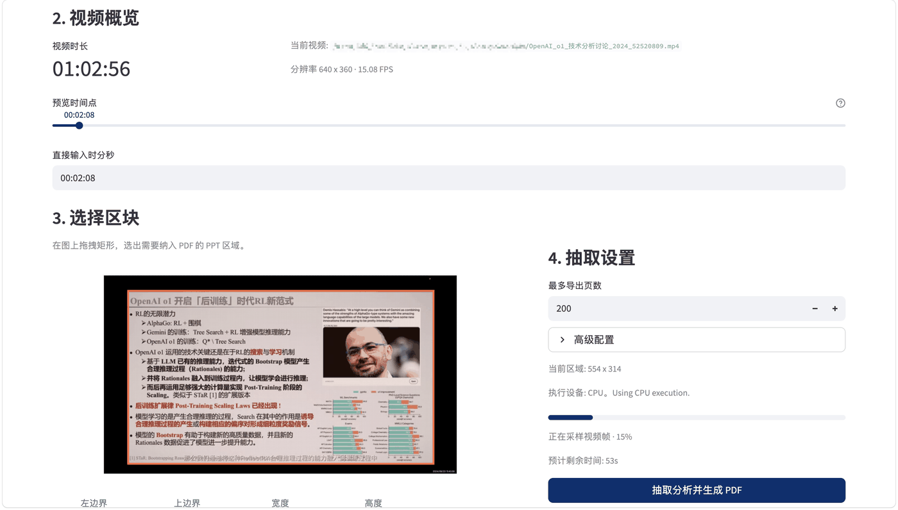
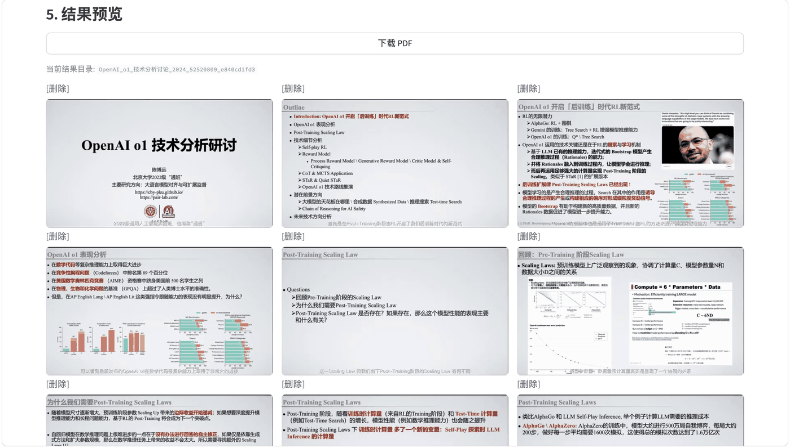

<table border="0" cellspacing="0" cellpadding="0">
  <tr>
    <td width="72" valign="middle" style="border:none; padding:0 12px 0 0;">
      
    </td>
    <td valign="middle" style="border:none; padding:0;">
      <h1>Screen2Slides</h1>
    </td>
  </tr>
</table>

[中文说明](README.md) | [English](README_EN.md)

Screen2Slides 用于从会议录屏、课程录屏或屏幕录制视频中，针对指定矩形区域自动抽取 PPT 页面，并导出为 PDF。

## 使用流程

1. 启动应用并打开页面。
2. 选择一个视频文件。
3. 框选 Slides 区域。
4. 点击开始分析。
5. 预览结果并下载 PDF。

快速上手建议:

- 个人使用直接运行 `run_app_local.sh`
- 默认 `cpu + ssim` 即可开始使用
- 高级配置保持折叠，先跑通一轮再细调

## 案例示例

下面给出一个完整的会议视频抽取示例，便于快速理解实际使用流程。

示例会议视频:

- https://www.bilibili.com/video/BV15Rx5eXEnW/

选择 Slides 区域并执行分析:



结果 PDF 导出:



实验室提供的完整版 PDF，用于结果对照验证:

- https://alignmentsurvey.com/uploads/pair_lab/talks/post_train.pdf

## 功能概览

- 支持本地视频选择、服务器上传、兼容模式三种启动方式
- 支持在预览帧上框选需要保留到 PDF 的矩形区域
- 支持 `ssim`、`histogram`、`ahash` 三种相似度算法
- 支持 `cpu / gpu / auto` 执行设备选择
- 支持抽取结果缩略图预览，并手工删除或恢复页面后再导出 PDF
- 生成 `slides/*.jpg`、`slides.pdf`、`manifest.json`
- 生成的 PDF 会按页面时间戳写入书签

## 参数建议

默认建议:

- 默认 `cpu` 已足够日常使用
- 有 GPU 时，再手动切换到 `gpu` 或 `auto` 即可
- 一般先从 `ssim` 开始

推荐参数组合:

| 场景 | 推荐算法 | 相似度阈值 |
| --- | --- | --- |
| Slides 位置完全确定，且无字幕干扰 | `ssim` | `0.98` |
| Slides 位置完全确定，但存在字幕干扰 | `ssim` | `0.92` |
| Slides 位置完全确定，但演讲人物以小窗形式出现 | `ssim` | `0.85` |
| Slides 位置难以确定，且镜头切换频繁 | `ssim` | `0.80` |

调参方向:

- 如遗漏页面较多，可缩小采样间隔、缩小最短稳定时长，并适当提高相似度阈值
- 如重复页面较多，可适当降低相似度阈值

## 运行环境

- Python `3.9+`
- 推荐先激活自己的 Conda 或 virtualenv 环境
- 基础依赖见 `requirements.txt`
- 默认直接使用 CPU，无需额外 GPU 配置
- 如需 GPU 加速，可额外安装与你环境匹配的 `torch`

安装依赖:

```bash
pip install -r requirements.txt
```

如果你使用 Conda，也可以先进入目标环境后再安装依赖，例如:

```bash
conda activate <your_env_name>
pip install -r requirements.txt
```

## 启动方式

应用默认监听 `0.0.0.0:9555`。

可直接访问:

- 本机部署: <http://localhost:9555>
- 局域网访问: `http://<your_server_ip>:9555`

个人使用默认推荐本地模式:

```bash
bash run_app_local.sh
```

也可以使用:

```bash
bash run_app_upload.sh
bash run_app_hybrid.sh
```

说明:

- `run_app_local.sh`: 本地模式，只显示本地视频选择，适合个人使用
- `run_app_upload.sh`: 服务器上传模式，只显示上传入口
- `run_app_hybrid.sh`: 兼容模式，可在本地视频和服务器上传之间切换
- `run_app.sh`: 等价于 `run_app_local.sh`

如果需要自定义 Python，可传入:

```bash
PYTHON_BIN=python bash run_app_local.sh
```

## 本地 CLI

除了网页界面，也支持本地命令行调用。

最简用法:

```bash
bash run_cli.sh /path/to/video.mp4
```

等价写法:

```bash
python -m screen_to_slides.cli /path/to/video.mp4
```

常用参数:

- `--output-dir`: 输出根目录，默认使用输入视频所在目录
- `--mode`: `ssim` / `histogram` / `ahash`
- `--device`: `cpu` / `gpu` / `auto`，默认 `cpu`
- `--sample-every-seconds`: 采样间隔，默认 `1.0`
- `--similarity-threshold`: 相似度阈值，默认 `0.98`
- `--min-stable-seconds`: 最短稳定时长，默认 `2.0`
- `--max-slides`: 最多导出页数，默认 `200`
- `--x --y --width --height`: 指定 ROI；如果都不传，则默认整屏处理

示例:

```bash
bash run_cli.sh /path/to/video.mp4 \
  --mode ssim \
  --device cpu \
  --similarity-threshold 0.92 \
  --sample-every-seconds 0.5 \
  --min-stable-seconds 1.0 \
  --max-slides 300
```

## 输出内容

每次任务会在输出目录下生成一个以“视频名 + 随机串”命名的结果目录，通常包含:

- `slides/`: 抽取出的页面图片
- `slides.pdf`: 导出的 PDF
- `manifest.json`: 页面时间戳、图片路径等元数据

## 许可证

本项目采用 `PolyForm Noncommercial 1.0.0`。

- 非商业用途可直接使用
- 商业用途、企业部署、再分发或其他授权合作，请联系作者获取商业授权
- 该许可证更准确地属于 source-available，而不是传统 OSI 开源许可证

- Amoiensis
- GitHub: <https://github.com/Amoiensis>
- Email: <amoiensis@outlook.com>

详细条款见 [LICENSE](LICENSE)。

当前版本: `0.1.0`

GitHub: <https://github.com/Amoiensis/Screen2Slides>
